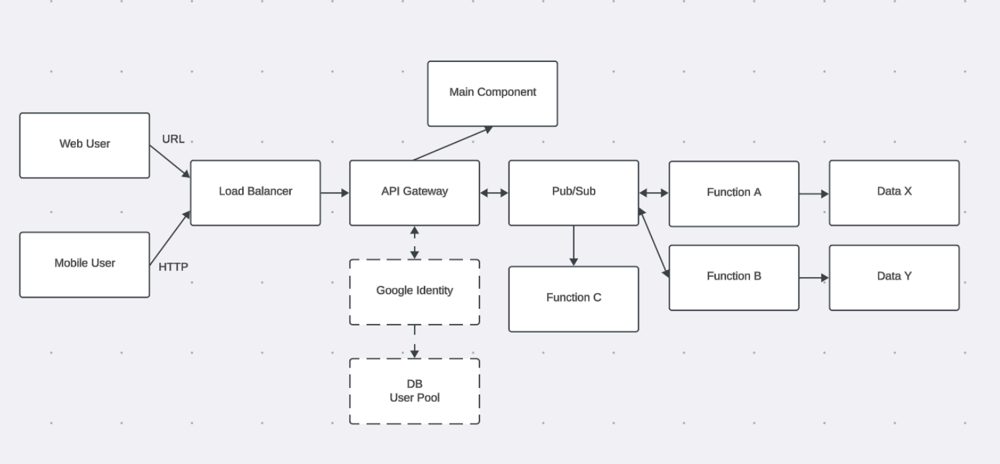

# Overview
Syscourse is a content-sharing platform that allows its user to upload educational resources and make them accessible to others. Users can:

- Upload educational resources

- Access shared content from other users

The system is built in Google Cloud using a microservices architecture deployed on Kubernetes, with serverless components and API Gateway integration to ensure performance and reliability.

## Tools and Architecture

Frontend: Python Flask

Backend: Django

Database: Firestore, Cloud Storage

Syscourse follows a microservices architecture deployed on Kubernetes.

- The Flask frontend handles user interactions and communicates with backend services through secure API endpoints.

- The Django backend exposes REST APIs responsible for business logic, authentication, and resource management.

- All requests pass through an API Gateway, which validates JWT tokens and routes traffic to the appropriate services.

- Firestore stores structured application data, while Cloud Storage manages uploaded educational resources.

- Pub/Sub enables asynchronous communication between services for event-driven workflows (e.g., processing uploads).

- Infrastructure and services are deployed and managed within Google Kubernetes Engine (GKE)

## Goal
### High Performance: 
Latency should be kept below 300ms for 95% of requests over a 28-day period.
- Optimize code and use caching mechanisms to reduce latency.
- Use of containers to create a lightweight, isolated environment
- Use of small, independent serverless functions that execute in response to requests / events

### Highly Scalable
Microservices should be designed as serverless functions with loose coupling, capable of automatically scaling based on demand.
- Use of Kubernetes to provide auto-scaling
- Achieve loose coupling through the use of cloud functions
- Use Api Gateways

### Highly Available
Kubernetes nodes should have a 99% uptime over a 29-day period, achieved through proper autoscaling, automated container restarts, and workload balancing.
- Use of pub/sub to enable asynchronous communication between services 
- Setup multi-region firestore
- Automated container restarts by deploying to container orchestration service like k8s

### Secure
Calls to microservices should pass through an API Gateway and have the right Ingress setup to protect against unauthorized access.z
- Configure API Gateway to take requests from and forwards the requests to proper cloud functions
- Require JWT token when creating requests
- Use Ingress for secure communication.

## Note
This repo is a public release of forked private repo where old commits contained sensitive API keys, hence why there is no history
